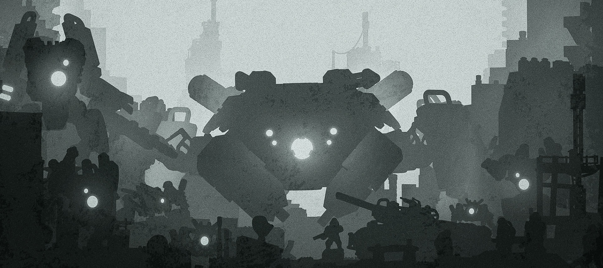

# Full Spectrum Wiki

Welcome to the Full Spectrum Wiki!
Here we will contain all the *canon* information about the universe of Full Spectrum Dominance, from the events before the [Schism](history#the-schism) up until the present time.

{: width="80%"}

## The Setting

After a sudden and devastating war between humans and a widespread Hive AI that left humanity broken and scattered among the stars, the survivors started to rebuild - and fight.  
*You can read more about the history of the setting on [the dedicated page](history).*

All the recent events and relevant locations mentioned in the game settings are centered around [Luyten](luyten), one of the many worlds colonized by humanity and now left stranded to fend for themselves. Even though there are countless other stars in a similar state of chaos, they are all too far to be reached by Luyten, and therefore not important.

## The Game

Full Spectrum Dominance (FSD) is a miniature wargame for epic small-scale sci-fi miniatures in 6-8 mm scale. 
You can fit two armies and a full battlefield on a coffee table, as little as 2 x 3 feet, moving platoons and tank groups with the same ease you would do in a skirmish game. Moreover, using arbitrary "Distance Units" for distances and ranges you can scale the game up and down as you please.

The rules are based around a dice-based activation engine utilising unit cards on which dice are placed to power different effects. This ensures that, at any moment, all players are involved in the game! Players must balance their resources and choose every action carefully while minimizing the downtimes with reactions and triggers.

## The Miniatures
The [official models](https://www.myminifactory.com/users/TheLazyForger) are designed for resin 3D printing, but you can use all kind of small-scale models, or use one of our [licensed vendors](https://fsd-wargame.com/authorized-3d-printers/) to get your fix of small scale goodies. 

## Other Resources
**Online Store:** https://www.myminifactory.com/users/TheLazyForger
**Official Website:** https://fsd-wargame.com/  
**Online Army Builder:** https://fsd-wargame.com/roster/
**Discord Channel:** https://discord.gg/39exwYM9gn  
**Facebook Group:** https://www.facebook.com/groups/fullspectrumdominance  
